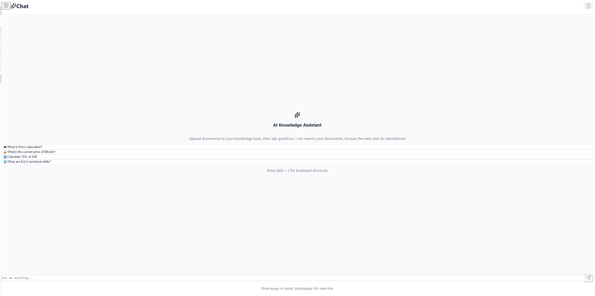
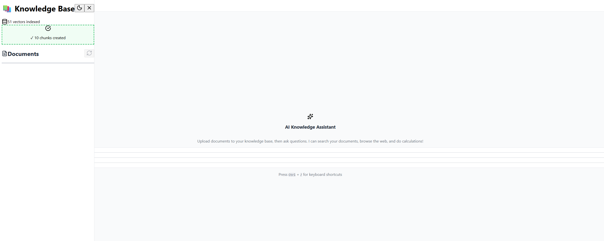
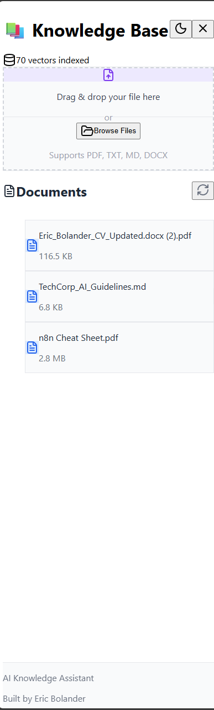
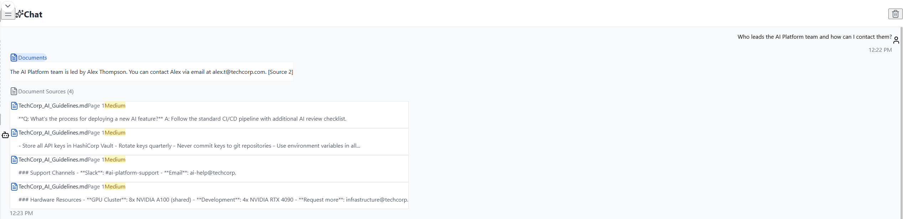
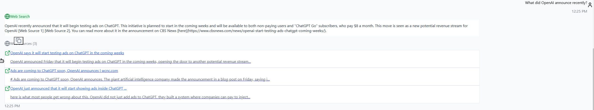
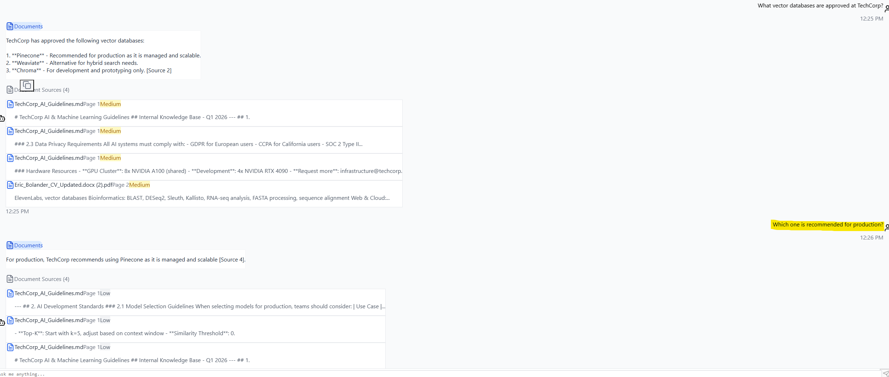

# 🤖 AI Knowledge Assistant

A full-stack AI-powered knowledge assistant that combines RAG (Retrieval-Augmented Generation), web search, and conversational AI into a unified interface. Upload documents, ask questions, and get intelligent responses with source citations.



## ✨ Features

- **📄 Document Intelligence** - Upload PDFs, DOCX, TXT, and Markdown files. The system chunks, embeds, and indexes your documents for semantic search.

- **🔍 Smart Query Routing** - AI automatically determines whether to search your documents, the web, or use its general knowledge based on your question.

- **🌐 Web Search Integration** - Real-time web search via Tavily API for current information and news.

- **🧮 Built-in Calculator** - Mathematical calculations handled automatically when detected.

- **💬 Conversation Memory** - Maintains context across your chat session for natural follow-up questions.

- **📚 Source Citations** - Every answer includes citations linking back to the source documents or web pages.

- **🌙 Dark Mode** - Beautiful dark theme UI with smooth transitions.

## 🛠️ Tech Stack

### Backend
- **FastAPI** - High-performance Python web framework
- **LangChain** - LLM orchestration and RAG pipeline
- **OpenAI GPT-4o** - Large language model for responses
- **Pinecone** - Vector database for document embeddings
- **Tavily** - Web search API

### Frontend
- **Next.js 16** - React framework with App Router
- **TypeScript** - Type-safe development
- **Tailwind CSS** - Utility-first styling
- **Lucide React** - Beautiful icons

### Infrastructure
- **Railway** - Backend hosting
- **Vercel** - Frontend hosting
- **GitHub** - Version control & CI/CD

## 🚀 Live Demo

- **Frontend:** [ai-knowledge-assistant.vercel.app](https://ai-knowledge-assistant-git-main-eric-bolanders-projects.vercel.app)
- **Backend API:** [ai-knowledge-assistant-production.up.railway.app](https://ai-knowledge-assistant-production-7cdf.up.railway.app/health)

## 📸 Screenshots

### Main Interface
Clean, intuitive chat interface with example queries for documents, web search, calculations, and more.


### Document Upload & Processing
Drag-and-drop file upload with real-time chunking feedback. Supports PDF, DOCX, TXT, and Markdown files.



### Knowledge Base Sidebar
View indexed vectors, uploaded documents, and manage your knowledge base.



### Document RAG with Citations
Ask questions about your uploaded documents and get answers with source citations showing relevance scores.



### Web Search Integration
Real-time web search for current events and information not in your documents, with clickable source links.



### Multi-Turn Conversations
Conversation memory enables natural follow-up questions - the AI remembers context from previous messages.



## 📦 Installation

### Prerequisites
- Python 3.11+
- Node.js 18+
- API Keys for: OpenAI, Pinecone, Tavily

### Backend Setup

```bash
cd backend

# Create virtual environment
python -m venv venv
source venv/bin/activate  # On Windows: .\venv\Scripts\Activate

# Install dependencies
pip install -r requirements.txt

# Configure environment
cp .env.example .env
# Edit .env with your API keys

# Run the server
uvicorn main:app --reload
```

### Frontend Setup

```bash
cd frontend

# Install dependencies
npm install

# Configure environment
cp .env.example .env.local
# Edit .env.local with your backend URL

# Run development server
npm run dev
```

## 🔧 Environment Variables

### Backend (.env)
```
OPENAI_API_KEY=your-openai-api-key
PINECONE_API_KEY=your-pinecone-api-key
TAVILY_API_KEY=your-tavily-api-key
PINECONE_INDEX_NAME=knowledge-assistant
```

### Frontend (.env.local)
```
NEXT_PUBLIC_API_URL=http://localhost:8000
```

## 📁 Project Structure

```
ai-knowledge-assistant/
├── backend/
│   ├── app/
│   │   ├── agents.py      # Multi-tool AI agent
│   │   ├── citations.py   # Source citation manager
│   │   ├── config.py      # Configuration settings
│   │   ├── document.py    # Document processing
│   │   ├── embeddings.py  # Vector embeddings
│   │   └── retrieval.py   # RAG retrieval logic
│   ├── main.py            # FastAPI application
│   ├── requirements.txt
│   └── Dockerfile
│
├── frontend/
│   ├── src/
│   │   ├── app/           # Next.js app router
│   │   ├── components/    # React components
│   │   ├── lib/           # API client
│   │   └── types/         # TypeScript types
│   ├── package.json
│   └── tailwind.config.ts
│
├── docs/
│   └── screenshots/       # Application screenshots
│
└── README.md
```

## 🔌 API Endpoints

| Method | Endpoint | Description |
|--------|----------|-------------|
| GET | `/health` | Health check with index stats |
| POST | `/chat` | Send a message, get AI response |
| POST | `/upload` | Upload a document |
| GET | `/documents` | List uploaded documents |
| DELETE | `/documents/{filename}` | Delete a document |
| POST | `/clear-history` | Clear conversation history |
| POST | `/index/clear` | Clear all vectors from index |

## 🎯 How It Works

1. **Document Upload** - Documents are processed, split into chunks, and embedded using OpenAI's text-embedding-3-small model.

2. **Query Classification** - When you ask a question, the AI agent classifies the intent (document search, web search, calculator, or general knowledge).

3. **Tool Execution** - Based on classification:
   - **Documents**: Semantic search against your uploaded files
   - **Web Search**: Real-time Tavily search for current info
   - **Calculator**: Safe math expression evaluation
   - **General**: Direct LLM response

4. **Response Generation** - GPT-4o generates a response using the retrieved context, with proper source citations.

## 🧪 Testing

```bash
# Backend tests
cd backend
pytest

# Test API endpoints
curl http://localhost:8000/health
```

## 🚢 Deployment

### Backend (Railway)
1. Connect your GitHub repo to Railway
2. Set root directory to `backend`
3. Add environment variables
4. Deploy!

### Frontend (Vercel)
1. Import project from GitHub
2. Set root directory to `frontend`
3. Add `NEXT_PUBLIC_API_URL` environment variable
4. Deploy!

## 🛣️ Roadmap

- [ ] Multi-user authentication
- [ ] Chat history persistence
- [ ] More file format support (CSV, Excel)
- [ ] Voice input/output
- [ ] Custom model selection

## 👨‍💻 Author

**Eric Bolander**
- GitHub: [@Ebolander23](https://github.com/Ebolander23)
- LinkedIn: [Eric Bolander](https://www.linkedin.com/in/eric-bolander/)

## 📄 License

This project is licensed under the MIT License - see the [LICENSE](LICENSE) file for details.

---

Built with ❤️ as a learning project to explore modern AI application architecture.
